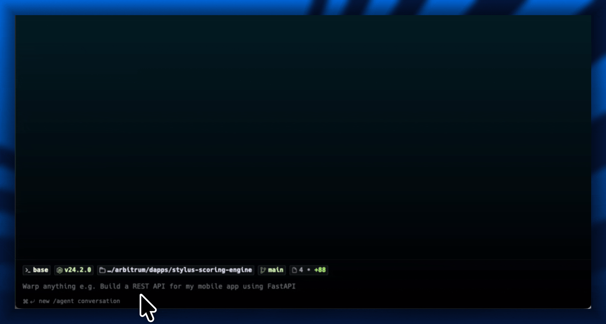

<p align="center">
  
</p>

<p align="center">
  <a href="LICENSE"></a>
  
  
  
  <a href="https://github.com/hummusonrails/stylus-scoring-engine/issues"></a>
</p>

<p align="center">
  <strong>Verifiable credit/risk scoring on Arbitrum with a three-way gas benchmark: offchain Rust vs onchain Stylus vs onchain Solidity.</strong>
  <br>
  <a href="#quick-start">Quick Start</a> · <a href="#architecture">Architecture</a> · <a href="https://github.com/hummusonrails/stylus-scoring-engine/issues">Report a Bug</a>
</p>

## What it does

- **Benchmarks** the same scoring algorithm across three execution environments with real gas numbers
- **Scores** entities against configurable weighted rules with iterative convergence and cross-factor correlation
- **Demonstrates** Stylus gas savings on compute-heavy workloads (over 90% cheaper than Solidity)
- **Shares** Rust types between the onchain contract and offchain API server from a single crate
- **Stores** scoring rules in SQLite with full CRUD via REST endpoints

<br>

<p align="center">
  
</p>

<br>

## Quick Start

```bash
# clone and install
git clone https://github.com/hummusonrails/stylus-scoring-engine.git
cd stylus-scoring-engine
pnpm install

# start the local arbitrum devnode
pnpm devnode

# in a new terminal, deploy both contracts
pnpm deploy:all

# start the api server (reads .env written by deploy)
pnpm api

# in a new terminal, run the three-way benchmark
pnpm benchmark
```

<details>
<summary><strong>Prerequisites</strong></summary>

- [Rust](https://rustup.rs/) 1.88+ with `wasm32-unknown-unknown` target (`rustup target add wasm32-unknown-unknown`)
- [cargo-stylus](https://github.com/OffchainLabs/cargo-stylus) (`cargo install cargo-stylus`)
- [Foundry](https://book.getfoundry.sh/getting-started/installation) (`curl -L https://foundry.paradigm.xyz | bash && foundryup`)
- [Docker](https://docs.docker.com/get-docker/) for the local Arbitrum devnode
- [pnpm](https://pnpm.io/installation)
- [Node.js](https://nodejs.org/) 18+

</details>

## Architecture

The project is a pnpm monorepo with a Cargo workspace. The API server owns the business rules and calls both the Stylus and Solidity contracts as compute backends.

```
Client → Axum API → loads rules from SQLite → calls Stylus + Solidity contracts → returns scored results
```

| Layer | Tool | Notes |
|:------|:-----|:------|
| Stylus contract | stylus-sdk 0.10 + Rust | Stateless scoring, compiled to WASM |
| Solidity contract | Foundry + Solidity 0.8.23 | Same algorithm for gas comparison |
| Shared types | serde + no_std/std feature flag | Same Rust types on both sides of the chain boundary |
| API server | Axum | REST endpoints, SQLite rule storage, benchmark endpoint |
| Chain interaction | alloy | ABI encoding, gas estimation, contract calls |
| Fixed-point math | fixed crate (I40F24) | Precise weighted scoring without floats |

## Available commands

| Command | Description |
|:--------|:------------|
| `pnpm devnode` | Start the local Arbitrum devnode |
| `pnpm deploy:all` | Build and deploy both contracts, write .env |
| `pnpm deploy:stylus` | Deploy only the Stylus contract |
| `pnpm deploy:solidity` | Deploy only the Solidity contract |
| `pnpm api` | Start the API server (reads .env) |
| `pnpm benchmark` | Add rules and run three-way gas benchmark |
| `pnpm build` | Build both contracts |
| `pnpm test` | Run tests |
| `pnpm check` | Run `cargo stylus check` |
| `pnpm export-abi` | Export Stylus ABI |
| `pnpm fund` | Fund test accounts with ETH |
| `pnpm clean` | Remove build artifacts |

## API endpoints

| Method | Path | Description |
|:-------|:-----|:------------|
| GET | `/health` | Health check, returns contract address |
| POST | `/rules` | Create a scoring rule |
| GET | `/rules` | List all rules |
| POST | `/score` | Score an entity against stored rules via the Stylus contract |
| POST | `/benchmark` | Three-way comparison: offchain Rust, onchain Stylus, onchain Solidity |

## Project structure

```
stylus-scoring-engine/
├── contracts/
│   ├── scoring-engine/           # stylus contract (rust/wasm)
│   │   ├── Cargo.toml
│   │   ├── Stylus.toml
│   │   ├── package.json          # build/test/check/deploy scripts
│   │   └── src/
│   │       ├── lib.rs            # scoring algorithm
│   │       └── main.rs           # abi export entrypoint
│   └── scoring-engine-sol/       # solidity contract (foundry)
│       ├── foundry.toml
│       ├── package.json          # build/test/deploy scripts
│       └── src/
│           └── ScoringEngine.sol # same algorithm in solidity
├── api/
│   ├── Cargo.toml
│   └── src/
│       ├── main.rs               # axum server entry
│       ├── routes.rs             # endpoint handlers
│       ├── scoring.rs            # offchain scoring (mirrors contract)
│       ├── db.rs                 # sqlite rule storage
│       └── chain.rs              # contract interaction via alloy
├── shared/
│   ├── Cargo.toml
│   └── src/lib.rs                # types shared across onchain/offchain
├── scripts/
│   ├── deploy.sh                 # deploy both contracts, write .env
│   ├── funds.sh                  # fund test accounts
│   └── benchmark.sh              # run three-way gas comparison
├── nitro-devnode/
│   └── run-dev-node.sh           # start local arbitrum node
├── Cargo.toml                    # workspace root
├── Stylus.toml                   # workspace marker
├── package.json                  # pnpm scripts
└── pnpm-workspace.yaml
```

## The benchmark

The `/benchmark` endpoint runs the same scoring algorithm (10 factors, 10 correlation pairs, 50 convergence iterations with damped oscillation math) in three environments. In our benchmark, Stylus used over 90% less gas than the equivalent Solidity contract:

| Environment | Score | Gas | Notes |
|:------------|------:|----:|:------|
| Offchain Rust | 953 | n/a | local function call |
| Onchain Stylus | 953 | 76,048 | over 90% cheaper than Solidity |
| Onchain Solidity | 810 | 1,027,635 | baseline onchain cost |

Exact gas numbers vary by environment, but the relative savings are consistent. The heavier the computation, the wider the gap. Stylus executes iterative math and fixed-point arithmetic in WASM at near-native speed, while the EVM pays per-opcode costs that add up fast in loops. The score difference (953 vs 810) comes from Rust's `I40F24` fixed-point type being more precise than Solidity's integer division.

## Contributing

Contributions are welcome. Open an issue to discuss what you'd like to change, or submit a pull request directly.

## License

[MIT](LICENSE)
